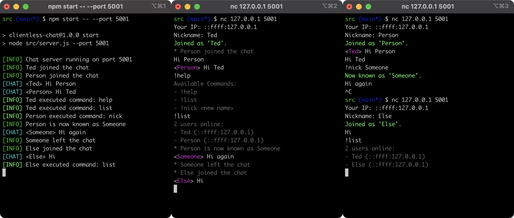

# Clientless Chat App
 
> A client-less multi-user chat server using Netcat and the TCP protocol.

## Table of contents

- [About the Project](#about-the-project)
- [Prerequisites](#prerequisites)
- [Installation](#installation)
- [Usage](#usage)
    - [Server](#server)
    - [Client](#client)
- [License](#license)

## About the project

<br>
<div align="center">
  
  <span>Server (left), Clients (middle, right)</span>
</div>
<br>

A command-line chat app that requires only a server. Users can connect using Netcat, a simple TCP client already built into most operating systems. Built using Node.js and the `net` module.

## Prerequisites

- Node.js & NPM
- [Netcat](https://github.com/diegocr/netcat) client

## Installation

```bash
# Clone the repository
$ git clone https://github.com/TedAlden/clientless-chat

# Navigate to the project directory
$ cd clientless-chat

# Install node packages
$ npm install
```

## Usage

### Server

```bash
# Start chat server
$ npm start

# Start with a specific a port
$ npm start -- --port 5001

# Alternatively, like this
$ node src/server.js --port 5001
```

### Client

Using the Netcat client the command may be `nc` or `nc64`.

```bash
# Connect using Netcat to <ip> <port>
$ nc 127.0.0.1 5001
```

## License

Distributed under the MIT License. See `LICENSE` for more information.
